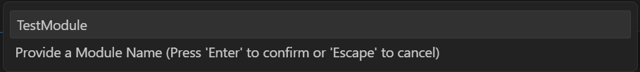
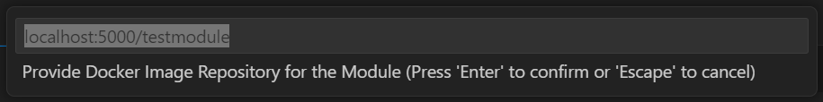
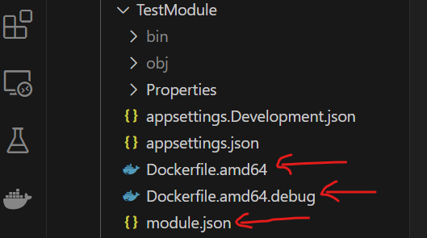
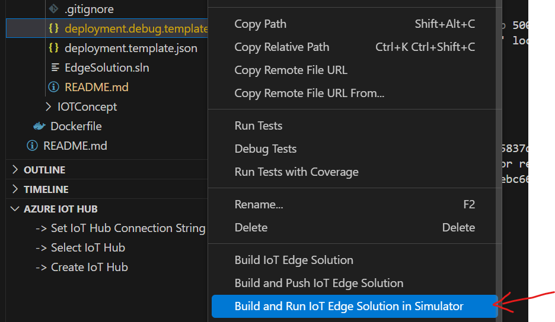
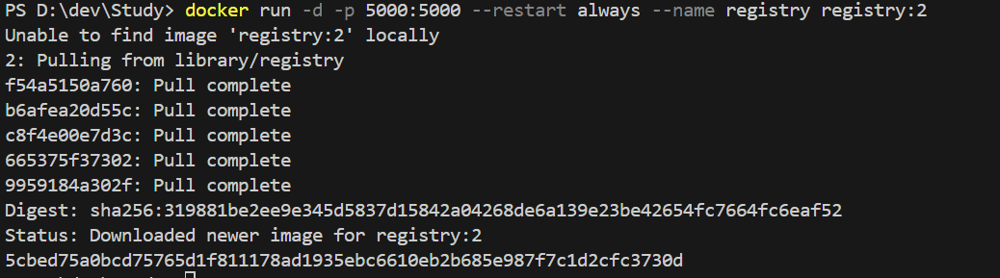
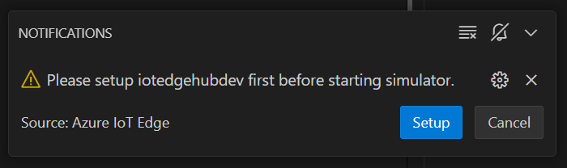
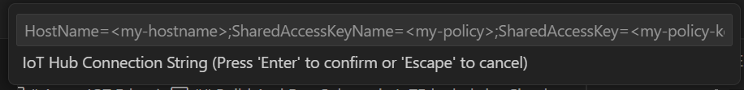

# Azure IOT Edge 
For the development we will use iotedgehubdev simulator.

## Setup Local Development

**Step 1** : Install Python(3.10.9) with PIP.

1. [Python 3.10.9](https://www.python.org/downloads/release/python-3109/) After Installer download Run that Installer and Please Select **Custom Installation** and then select PIP in the Checkbox as below image.

    

    After Installation Check Version in Cmd
    ```bash
    py --version
    ```
    


2. Install [IOTEDGEHUBDEV](https://pypi.org/project/iotedgehubdev/0.10.0/)

    ```bash
    pip install --upgrade iotedgehubdev
    ```
    
    check in environment variable Python Script path should be there if not then please add as below image

    `C:\Users\YourPcUsername\AppData\Local\Programs\Python\Python310\Scripts\`
    

    Setup IoTEdgehubdev

    * Window

        ```bash
        iotedgehubdev setup -c "<edge-device-connection-string>"
        ```
    * Linux/macOS
        ```bash
        sudo iotedgehubdev setup -c "<edge-device-connection-string>"
        ```
    Or We can also setup in Vs code too see below steps in VS code Extension step.


**Step 2** : Install `Azure CLI`

Download: [Azure Cli Installer](https://learn.microsoft.com/en-us/cli/azure/install-azure-cli-windows?pivots=msi)


Run Below command in CMD to login to azure.
```bash
az login
```

**Step 3** : Install Docker
> We are using docker desktop you can use only docker run time  

*Windows*

[Docker Desktop Installer](https://docs.docker.com/desktop/setup/install/windows-install/
)


## Using VS Code IDE

**Step 1** : Install `Azure IoT Edge` Extension

> After Extention Installed Make sure to reload Vs code 


**Step 2** : Create IoT EdgeSolution

1. Open Command Palette (`ctrl+shift+p`), Search `Azure IoT Edge: new IoT Edge Solution` as in below image. And Press Enter

    

2. Select Directory And Provide Solution Name I am keeping default `EdgeSolution` Press Enter

    

3. Select Module : I am using `C# Module`

    

4. Provide Module Name: `TestModule`
    

5. Provide Docker Image Container Registry: Using default local registry
    

> After all above steps you will see these project structure as below Image.


### Issue in `Azure IoT Edge` Extension

There is an issue in `Azure IoT Edge` Extention by default it is not creating `module.json` and `Dockerfile` for C# module. so please add manually.
    

## Build And Run Soluton in IoTEdgehubdev Simulator
> Make sure to run docker desktop/service before below steps.

1. Right Click on `deployment.debug.template.json` file and select **Build and Run IOT Edge Solution In Simulator**. as in below screen.
    

    It will run the registry image
    

2. If iotedgehubdev not setup
    A notification will pop-up to setup click on setup button.

    

    * Provide IoT Hub Connection string 
        

3. After iotedgehubdev setup re-run Step 1 again i.e => Right Click on `deployment.debug.template.json` file and select **Build and Run IOT Edge Solution In Simulator**.


