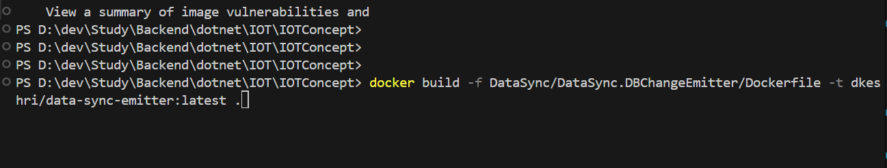

# Database Synchronizer With Rabbit MQ

### Docker Build from IOTConcept Directory 

```bash
docker build -f DataSync/DataSync.DBChangeEmitter/Dockerfile -t dkeshri/data-sync-emitter:latest .
```


## Project Summary

This Project Get the changes of Tables and the push it to RabbitMQ Queue.
Then Pick that Message and Update the database on other side.

For Eg. in IOT Application We sync data from Edge to cloud.

```bash
DECLARE @tableName NVARCHAR(128) = 'Customers';
DECLARE @sql NVARCHAR(MAX);

SET @sql = N'
SELECT 
    (SELECT TOP 1 * FROM ' + QUOTENAME(@tableName) + N' T WHERE T.Id = CT.Id FOR JSON AUTO) AS Data,
    CT.SYS_CHANGE_VERSION AS ChangeVersion,
    CT.SYS_CHANGE_OPERATION AS Operation
FROM CHANGETABLE(CHANGES ' + QUOTENAME(@tableName) + N', 0) AS CT
LEFT OUTER JOIN ' + QUOTENAME(@tableName) + N' T ON T.Id = CT.Id;
';

EXEC sp_executesql @sql;

Select * from ChangeTrackers
```
