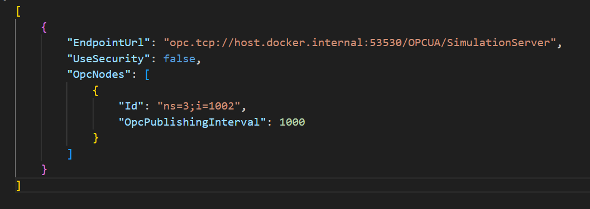

# OPC Publisher Configuration
[OPC Publisher](https://azure.github.io/Industrial-IoT/opc-publisher/) [OPC Publisher Command](https://azure.github.io/Industrial-IoT/opc-publisher/commandline.html)
## OPC UA Server Simulation
We are using Prosys simulation software Free version.

After installation Application look like below images.


Endpoint: `opc.tcp://dkeshri:53530/OPCUA/SimulationServer`

Note : When we are running the OPC Publisher running in docker container then *DNS* name `dkeshi` is unknown to OPC publisher it will not connect to it.

so to allow docker container to connect the OPC UA Server we need to do network configuration depending on host environment.

## Network Configuration 
Linux we just need to add `network_mode`: `'host'` in docker compose file and that's it. as show in below image.


Windows and Mac OS, this will not work but however on windows and mac we can directly connect with host by using special DNS name `host.docker.internal`.

we need to update the DNS name in configuration file `pn.json` of **OPC Publisher**.

>Replace DNS `dkeshri` to `host.docker.internal`

Example: just replace the **OPC UA Server** Address: `opc.tcp://dkeshri:53530/OPCUA/SimulationServer`
**to** `opc.tcp://host.docker.internal:53530/OPCUA/SimulationServer` as shown in below image.


## Run OPC Publisher

$$
Step 1: 
$$

Create OPC Publisher Configuration file `pn.json`.(PublisherNode file). It contain the settings to connect with OPC-UA Serve. file look like below image



OPC Publisher can connect with multiple serve. we just need to provide multiple endpoints in configuration file `pn.json` like below image.


$$
Step 2: 
$$

Create docker compose file [`docker-compose.yml`](./docker-compose.yml).

$$
Step 3: 
$$

Run docker compose command to create container. please make sure where you are running command `docker-compose.yml` and `pn.json` file show be in same directory. 

```bash
docker-compose up
```


*After OPC Publisher succesfully run and connected to OPC UA server it look like below images.*


When successfull conneced with OPC UA look like below image.


