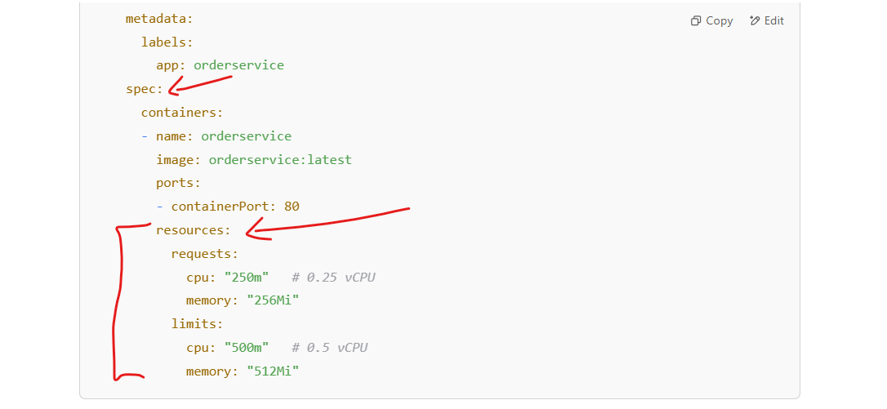
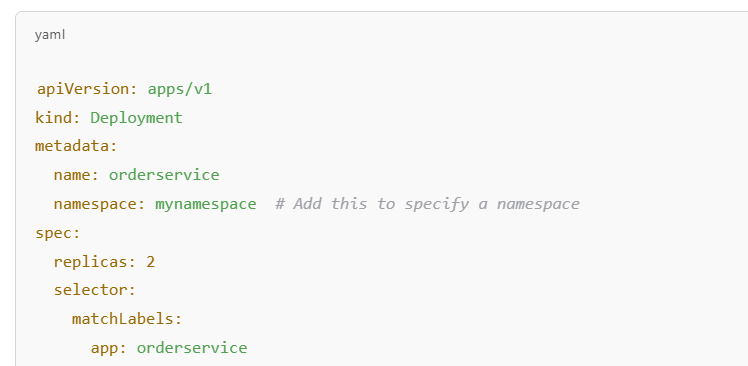
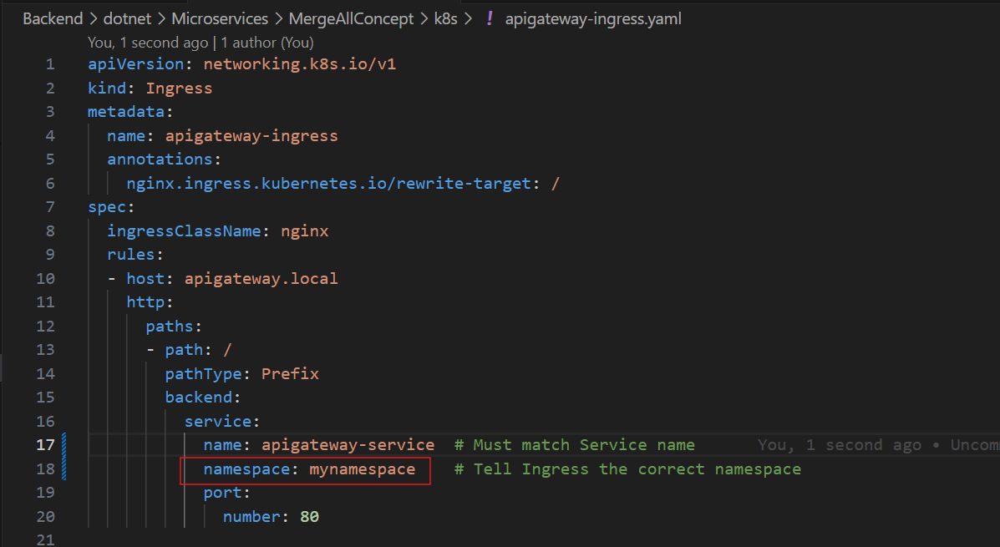

# Kubernetes

Kubernetes is an open-source container orchestration platform that automates the deployment, scaling, and management of containerized applications. It was originally developed by Google and is now maintained by the Cloud Native Computing Foundation (CNCF).

## Why is Kubernetes Important?

* **Automated Scaling** – Kubernetes can automatically scale applications up or down based on demand, ensuring efficient resource utilization.
* Self-Healing – If a container or node fails, Kubernetes automatically replaces or restarts it, maintaining application availability.
* **Load Balancing & Service Discovery** – It distributes traffic evenly across multiple instances of an application, improving performance and reliability.
* **Declarative Configuration & Automation** – Using YAML files, developers can define the desired state of an application, and Kubernetes ensures it remains in that state.
* **Multi-Cloud & Hybrid Cloud Support** – Kubernetes works across different cloud providers and on-premises environments, making it highly flexible.
* **Rolling Updates & Rollbacks** – It allows for smooth updates without downtime and can revert to a previous version if needed.
* **Resource Efficiency** – Kubernetes optimizes infrastructure utilization, reducing costs by running applications efficiently on available hardware.

Overall, Kubernetes is essential for modern cloud-native applications, enabling developers and organizations to deploy and manage applications at scale with high resilience and automation.

1. **Enable Kubernetes in Docker Desktop**
    1. Open Docker Desktop.
    2. Go to Settings > Kubernetes.
    3. Check Enable Kubernetes and wait for it to start.

2. **Create Docker Images for Your Microservices**

    Ensure each microservice has a Dockerfile and build the images.

    For example, in each microservice folder, create a Dockerfile like this:

    Example `Dockerfile` for `OrderService`
    * [OrderService](../OrderService/Dockerfile)
    * [PaymentServive](../PaymentService/Dockerfile)
    * [InventoryService](../InventeryService/Dockerfile)
    * [ApiGatewayService](../ApiGateway/Dockerfile)
    * [AuthService](../AuthService/Dockerfile)
    * [OrchestratorService](../Orchestrator/Dockerfile)

    >Then build and tag the image, Make sure to Run Image Build commamd from **Parent Directory of K8s** -> `MergeAllConcept` directory.

    ```bash
    docker build -f ./OrderService/Dockerfile -t dkeshri/microservice-order-service:latest .
    ```
    > Repeat this for other services. like Payment,Inventory, Auth, ApiGateway and Orchestration Services.

3. **Write Kubernetes Deployment & Service Files**

    > Create a k8s folder and define YAML files.
    Deployment for OrderService

    * [apigateway-deployment.yaml](./apigateway-deployment.yaml)
    * [authservice-deployment.yaml](./authservice-deployment.yaml)
    * [orchestrator-deployment.yaml](./orchestrator-deployment.yaml)
    * [orderservice-deployment.yaml](./orderservice-deployment.yaml)
    * [paymentservice-deployment.yaml](./paymentservice-deployment.yaml)
    * [inventoryservice-deployment.yaml](./inventoryservice-deployment.yaml)
    * [mssql-deployment.yaml](./mssql-deployment.yaml)
    * [rabbitmq-deployment.yaml](./rabbitmq-deployment.yaml)

4. **Deploy Services to Kubernetes**
    
    1. *Apply the deployments*:
    > Make sure to run below command from **Parent Directory** of `k8s` -> `MergeAllConcept` directory.
    ```bash
    kubectl apply -f ./k8s
    ```
    If you are in current directoy of deployments.yaml files then you can run the command as below

    ```bash
    kubectl apply -f .
    ```

    2. *Check if pods are running*:
    ```bash
    kubectl get pods
    ```
    3. *Check services*:
    ```bash
    kubectl get services
    ```
Your services should now be running and scaled as specified.

## Next Steps

* Configure Ingress to expose your API Gateway externally.
* Set up Persistent Volume if your services need data storage.
* Use ConfigMaps & Secrets for environment variables.
* Implement Horizontal Pod Autoscaler (HPA) for dynamic scaling.

### Set Up Ingress for API Gateway

**Install Ingress Controller (if not installed)**

Since you're using Docker Desktop's Kubernetes, you need an Ingress controller like **Nginx**.

*Run:*

```bash
kubectl apply -f https://raw.githubusercontent.com/kubernetes/ingress-nginx/main/deploy/static/provider/cloud/deploy.yaml
```
*Verify installation:*
```bash
kubectl get pods -n ingress-nginx
```

### Create an Ingress Resource
*Create an Ingress Resource*
Save as [apigateway-ingress.yaml](./apigateway-ingress.yaml)


*Modify Your Hosts File (Windows)*

Edit the hosts file to map `apigateway.local` to `127.0.0.1`

1. Open Notepad as Administrator.
2. Open C:\Windows\System32\drivers\etc\hosts.
3. Add this line
```bash
127.0.0.1 apigateway.local
```
4. Save and close.

Now, you can access API Gateway at [http://apigateway.local.](http://apigateway.local)


### Set Up RabbitMQ in Kubernetes

*Deploy RabbitMQ*

[rabbitmq-deployment.yaml](./rabbitmq-deployment.yaml)

Apply it

```bash
kubectl apply -f rabbitmq-deployment.yaml
```

**Access RabbitMQ Dashboard**
Forward the `RabbitMQ` management port to your local machine:

```bash
kubectl port-forward service/rabbitmq-service 15672:15672
```
Now, open [http://localhost:15672/](http://localhost:15672/) in your browser.

Username: **guest**
Password: **guest**


Smilarly You can Also Access You OrderService and Other Deployed Services

Example My OrderService is Exposed in Kuberneties on Port `80` as you mapped you OrderService ContainerPort `8080` in  [orderservice-deployment.yaml](./orderservice-deployment.yaml)

To Access on host machine you can access you Service to Kubernetes Expose only as below

```bash
kubectl port-forward service/orderservice-service 7222:80 
```
You can Access it on host machine on **Port**: `7222` of `locahost` as URL: [http://localhost:7222/swagger](http://localhost:7222/swagger)


### Update Microservices to Use RabbitMQ

*Modify appsettings.json in your microservices:*

```json
"RabbitMQ": {
  "Host": "rabbitmq-service",
  "Port": 5672,
  "Username": "guest",
  "Password": "guest"
}
```
*Rebuild your microservices and restart the Kubernetes deployment:*

```bash
kubectl rollout restart deployment orderservice
kubectl rollout restart deployment orchestrator
```

### Final Checks
Run
```bash
kubectl get pods
```

**Ensure all services are Running.**
Access API Gateway: [http://apigateway.local](http://apigateway.local)
Access RabbitMQ: [http://localhost:15672](http://localhost:15672)

## Setting Up Horizontal Pod Autoscaler (HPA) in Kubernetes

Now, let’s configure Horizontal Pod Autoscaler (HPA) to dynamically scale your microservices based on CPU utilization.

1. **Enable Metrics Server in Kubernetes**

    Kubernetes HPA requires the Metrics Server to monitor CPU usage. If it’s not already installed, install it:

    ```bash
    kubectl apply -f https://github.com/kubernetes-sigs/metrics-server/releases/latest/download/components.yaml
    ```
    *Verify the installation:*
    ```bash
    kubectl get deployment metrics-server -n kube-system
    ```
    If it’s running, proceed.

    if any issue even if not worked then do below steps

    * Allow Insecure TLS (If Needed)
        If you're on Docker Desktop or Minikube, it might fail due to certificate issues. Fix it by patching the deployment:

        ```bash
        kubectl patch deployment metrics-server -n kube-system --type='json' -p='[{"op": "add", "path": "/spec/template/spec/containers/0/args/-", "value": "--kubelet-insecure-tls"}]'
        ```
        *Then restart:*
        ```bash
        kubectl delete pod -n kube-system -l k8s-app=metrics-server 
        ```

        Running the above command will force Kubernetes to delete the Metrics Server pod, and the Deployment will automatically create a new one:

        *Check if restared*
        ```bash
        kubectl get pods -n kube-system
        ```
        **It should Worked!**

        > If Still not worked Please follow below command and repeat above two steps
    * Delete and Reinstall Metrics Server
    Try deleting the existing Metrics Server and reinstalling:
        ```bash
        kubectl delete -f https://github.com/kubernetes-sigs/metrics-server/releases/latest/download/components.yaml
        kubectl apply -f https://github.com/kubernetes-sigs/metrics-server/releases/latest/download/components.yaml
        ```
2. **Add Resource Limits in Deployments**

    HPA requires resource requests and limits to be set in deployments.

    *Example: Modify* : [orderservice-deployment.yaml](./orderservice-deployment.yaml)

    add `resources` in above deployment file under `containers` as below screen.
    

    *Apply changes:*

    ```bash
    kubectl apply -f orderservice-deployment.yaml
    ```
3. **Deploy HPA for OrderService**

    *Create a new file:* [orderservice-hpa.yaml](./orderservice-hpa.yaml)

    *Apply it:*

    ```bash
    kubectl apply -f orderservice-hpa.yaml
    ```

4. **Verify HPA**

    *Check the HPA status:*

    ```bash
    kubectl get hpa
    ```
    Test scaling:

    ```bash
    kubectl get pods
    ```
    If CPU usage increases, Kubernetes will scale up `OrderService` pods automatically.

5. **Repeat for Other Services**
    Copy `orderservice-hpa.yaml`, rename it for `inventoryservice`, `paymentservice`, and `apigateway`.
    Adjust `minReplicas` and `maxReplicas` based on expected load.

## Setting Up Logging & Monitoring in Kubernetes with Prometheus and Grafana
Now, let's configure Prometheus to collect metrics and Grafana to visualize them.

1. **Install Prometheus & Grafana Using Helm**
    Since you’re using Docker Desktop, install Helm (a package manager for Kubernetes) if you haven’t already:

    1. Install Helm (if not installed):
        ```bash
        choco install kubernetes-helm -y  # for Windows using Chocolatey
        ```
    2. Add the Prometheus Helm repository:  
        ```bash
        helm repo add prometheus-community https://prometheus-community.github.io/helm-charts
        helm repo update
        ```
    3. Install Prometheus and Grafana in Kubernetes:
        ```bash
        helm install monitoring prometheus-community/kube-prometheus-stack --namespace monitoring --create-namespace
        ```
    Check the installation:
    ```bash
    kubectl get pods -n monitoring
    ```

## What is a Namespace in Kubernetes?

If you do not specify a namespace in your deployment.yaml, Kubernetes automatically assigns the resource to the default namespace.

To check the default namespace:
```bash
kubectl config view --minify 
```
**How to Check Resources in the Default Namespace?**
To list all pods in the default namespace:
```bash
kubectl get pods --namespace=default
```
or simply:

```bash
kubectl get pods
```
**How to Specify a Namespace in Deployment.yaml?**

If you want to explicitly assign your `orderservice` to a namespace, add the `namespace` field like this:



Modified OrderService : [orderservice-deployment.yaml](./orderservice-deployment.yaml)


**How to Create and Use a Custom Namespace?**

1.  Create a new namespace:
    ```bash
    kubectl create namespace mynamespace
    ```
2.  Deploy resources into this namespace:
    ```bash
    kubectl apply -f orderservice-deployment.yaml --namespace=mynamespace
    ```
3. Switch to a namespace (so you don’t need to specify --namespace every time):
    ```bash
    kubectl config set-context --current --namespace=mynamespace
    ```
**List All Namespaces**

```bash
kubectl get namespaces
```

**Example:** 

Keeping `Ingress` Service in `default` namespace but using `apigateway-service` from `mynamespace`




**Impact on Services**

If your `apigateway-service` remain in `default`, but your microservices (orderservice, paymentservice, etc.) is now in the `mynamespace` namespace, *cross-namespace communication must be handled.*

✅ Solution: *Use fully qualified domain names (FQDNs)* in ocelot.json.

```json
"DownstreamHostAndPorts": [
  {
    "Host": "orderservice-service.mynamespace.svc.cluster.local",
    "Port": 80
  }
]
```
* orderservice-service → Service name.
* mynamespace → Namespace where * orderservice-service is deployed.
* svc.cluster.local → Kubernetes default service domain.

Alternative: You can keep everything in the same namespace to simplify configuration.
**Impact on API Gateway Configuration (ocelot.json)**

If your `apigateway-service` is moved to `mynamespace`, but other services remain in default, you need to reference them correctly:

```json
"DownstreamHostAndPorts": [
  {
    "Host": "orderservice-service.default.svc.cluster.local",
    "Port": 80
  }
]
```
* If `orderservice-service` is in `default`, specify `.default.svc.cluster`.local.
* If `orderservice-service` is in `mynamespace`, specify `.mynamespace.svc.cluster.local`.

**Impact on kubectl Commands**

Once you introduce a namespace, you *must specify the namespace* in `kubectl` commands:
```bash
kubectl get pods -n mynamespace
kubectl get services -n mynamespace
kubectl describe ingress apigateway-ingress -n mynamespace
```
or *set the namespace as default*:

```bash
kubectl config set-context --current --namespace=mynamespace
```
✅ **Conclusion**

* Ingress must reference the correct namespace where `apigateway-service` is deployed.
* Services must use FQDN (`<service>.<namespace>.svc.cluster.local`) if they are in different namespaces.
* **Ocelot config must use correct service names based on namespaces.**
* Use `-n mynamespace` in `kubectl` commands or set it as default.


## Commands in Kubernetes

1. Apply change for one Service
    ```bash
    kubectl apply -f orderservice-deployment.yaml
    ```
2. Apply change to all Service
    Note: Make sure to Run below command from Parent directory of `k8s` i.e `MergeAllConcept`
    ```bash
    kubectl apply -f ./k8s
    ```
    If you want to apply current directort then use `.` instade for k8s directory
    ```bash
    kubectl apply -f .
    ```
3. Delete all the Deployment
    ```bash
    kubectl delete all --all --grace-period=0 --force   
    ```
4. Get Pod details
    ```bash
    kubectl get pods -o wide 
    ```
5. Get Service details
    ```bash
    kubectl get services -o wide
    ```
6. Get everything
    ```bash
    kubectl get all
    ```
7. Access Specefic Service on host machine
    like order service

    ```bash
    kubectl port-forward service/orderservice-service 7222:80 
    ```
    You can Access it on host machine on **Port**: `7222` of `locahost` as URL: [http://localhost:7222/swagger](http://localhost:7222/swagger)

**Command	Description**

| Parameter                    | Description     |
|----------------------------- |-----------------|
| `kubectl get pods -o wide` | 	Show where pods are running  |
| `kubectl get pod <pod-name> -o wide`|	Show node of a specific pod|
| `kubectl get pods -A -o wide`|   See all pods and where they are running |	
| `kubectl get pods -n kube-system`|	Check core Kubernetes system components|
| `kubectl top pods -A`	|   Show resource usage per pod|
| `kubectl get nodes -o wide`  | Show all nodes (master & workers) |
| `kubectl describe node <node-name>`|	Show node details|
| `kubectl get services -o wide`    | 	Show service details   |
| `kubectl cluster-info`|	Check if cluster is running|
| `kubectl get nodes -o wide`|  Check node status (master & workers)|
| `kubectl get events --sort-by=.metadata.creationTimestamp`|	Show cluster events (errors, warnings)|
| `kubectl get componentstatuses`|	Check Kubernetes component health|
| `kubectl top nodes`|	Show resource usage per node|
| `kubectl get hpa`|    Check the horizontal-pod-autoscale status|