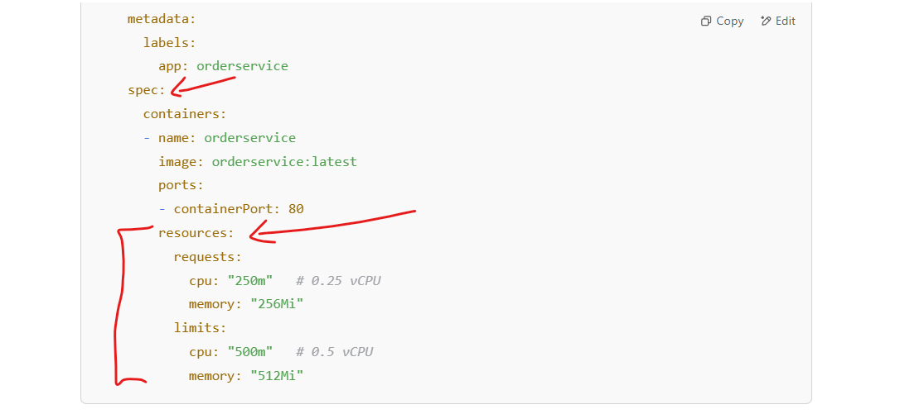

# Setting Up Horizontal Pod Autoscaler (HPA) in Kubernetes

Now, let’s configure Horizontal Pod Autoscaler (HPA) to dynamically scale your microservices based on CPU utilization.

1. **Enable Metrics Server in Kubernetes**

    Kubernetes HPA requires the Metrics Server to monitor CPU usage. If it’s not already installed, install it:

    ```bash
    kubectl apply -f https://github.com/kubernetes-sigs/metrics-server/releases/latest/download/components.yaml
    ```
    *Verify the installation:*
    ```bash
    kubectl get deployment metrics-server -n kube-system
    ```
    If it’s running, proceed.

    if any issue even if not worked then do below steps

    * Allow Insecure TLS (If Needed)
        If you're on Docker Desktop or Minikube, it might fail due to certificate issues. Fix it by patching the deployment:

        ```bash
        kubectl patch deployment metrics-server -n kube-system --type='json' -p='[{"op": "add", "path": "/spec/template/spec/containers/0/args/-", "value": "--kubelet-insecure-tls"}]'
        ```
        *Then restart:*
        ```bash
        kubectl delete pod -n kube-system -l k8s-app=metrics-server 
        ```

        Running the above command will force Kubernetes to delete the Metrics Server pod, and the Deployment will automatically create a new one:

        *Check if restared*
        ```bash
        kubectl get pods -n kube-system
        ```
        **It should Worked!**

        > If Still not worked Please follow below command and repeat above two steps
    * Delete and Reinstall Metrics Server
    Try deleting the existing Metrics Server and reinstalling:
        ```bash
        kubectl delete -f https://github.com/kubernetes-sigs/metrics-server/releases/latest/download/components.yaml
        kubectl apply -f https://github.com/kubernetes-sigs/metrics-server/releases/latest/download/components.yaml
        ```
2. **Add Resource Limits in Deployments**

    HPA requires resource requests and limits to be set in deployments.

    *Example: Modify* : [orderservice-deployment.yaml](./orderservice-deployment.yaml)

    add `resources` in above deployment file under `containers` as below screen.
    

    *Apply changes:*

    ```bash
    kubectl apply -f orderservice-deployment.yaml
    ```
3. **Deploy HPA for OrderService**

    *Create a new file:* [orderservice-hpa.yaml](./orderservice-hpa.yaml)

    *Apply it:*

    ```bash
    kubectl apply -f orderservice-hpa.yaml
    ```

4. **Verify HPA**

    *Check the HPA status:*

    ```bash
    kubectl get hpa
    ```
    Test scaling:

    ```bash
    kubectl get pods
    ```
    If CPU usage increases, Kubernetes will scale up `OrderService` pods automatically.

5. **Repeat for Other Services**
    Copy `orderservice-hpa.yaml`, rename it for `inventoryservice`, `paymentservice`, and `apigateway`.
    Adjust `minReplicas` and `maxReplicas` based on expected load.