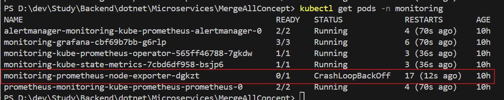

# Monitoring Setup in kubernetes

## Setting Up Logging & Monitoring in Kubernetes with Prometheus and Grafana

Now, let's configure Prometheus to collect metrics and Grafana to visualize them.

1. **Install Prometheus & Grafana Using Helm**
    Since you’re using Docker Desktop, install Helm (a package manager for Kubernetes) if you haven’t already:

    1. Install Helm (if not installed):
        ```bash
        choco install kubernetes-helm -y  # for Windows using Chocolatey
        ```
    2. Add the Prometheus Helm repository:  
        ```bash
        helm repo add prometheus-community https://prometheus-community.github.io/helm-charts
        helm repo update
        ```
    3. Install Prometheus and Grafana in Kubernetes:
        ```bash
        helm install monitoring prometheus-community/kube-prometheus-stack --namespace monitoring --create-namespace
        ```
    4. Check the installation:
        ```bash
        kubectl get pods -n monitoring
        ```
        
    6. Got Error for `monitoring-prometheus-node-exporter`
        This Error is for Windows Machine It is not able access cpu and other details of host machine

        🔄 Step 1: Upgrage Setting 

        Please create a file called: [prometheus-node-exporter.yaml](./prometheus-node-exporter.yaml) and run below command from the directory of created file
        ```bash
        helm upgrade monitoring prometheus-community/kube-prometheus-stack --namespace monitoring --values .\prometheus-node-exporter.yaml --force
        ```
        The `--force` flag forces Helm to reapply changes, ensuring node-exporter stays disabled.

        🔍 Step 2: Verify If It's Running
        ```bash
        kubectl get pods -n monitoring
        ```

        **How To Uninstall in Helm**
        ```bash
        helm uninstall monitoring -n monitoring
        ```
        **How to install with some modified setting**
        ```bash
        helm install monitoring prometheus-community/kube-prometheus-stack --namespace monitoring --values prometheus-node-exporter.yaml
        ```

        

2. **Expose Prometheus & Grafana Locally**

**Prometheus**

Port-forward Prometheus to access the dashboard:
```bash
kubectl port-forward -n monitoring svc/monitoring-kube-prometheus-prometheus 9090:9090
```
Now, open http://localhost:9090 in your browser.

**Grafana**

Port-forward Grafana:
```bash
kubectl port-forward -n monitoring svc/monitoring-grafana 3000:80
```
Now, open http://localhost:3000.

Username: `admin`
Password: `prom-operator`

3. **Configure Grafana to Use Prometheus**

1. Open `http://localhost:3000`.
2. Go to `Configuration → Data Sources`.
3. Click *Add Data Source*.
4. Select *Prometheus*.
5. Set the URL to: `http://monitoring-kube-prometheus-prometheus.monitoring:9090`.
6. Click **Save & Test.**

4. **Import Prebuilt Dashboards**

1. Go to Grafana → Dashboards.
2. Click Import.
3. Enter ID: 315 (for Kubernetes cluster monitoring).
4. Click Load → Select Prometheus Data Source → Click Import.

Now, you’ll see real-time monitoring of CPU, memory, and pod status.

