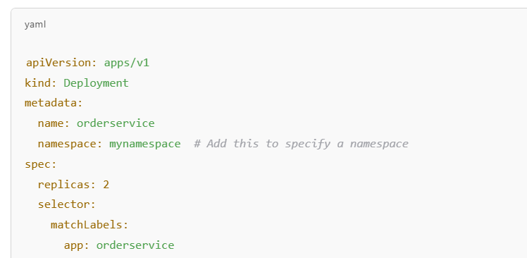

# What is a Namespace in Kubernetes?

A `namespace` in Kubernetes is a virtual cluster within a physical cluster. It allows you to separate resources logically, making it easier to manage multiple teams, projects, or environments within a single Kubernetes cluster.

Namespaces help in:

* Isolating resources between different teams or applications.
* Avoiding name conflicts (e.g., two different teams can create a orderservice pod in different namespaces).
* Applying resource limits (like CPU, memory) at the namespace level.

**What is the Default Namespace?**

If you do not specify a namespace in your deployment.yaml, Kubernetes automatically assigns the resource to the default namespace.

To check the default namespace:
```bash
kubectl config view --minify 
```
**How to Check Resources in the Default Namespace?**
To list all pods in the default namespace:
```bash
kubectl get pods --namespace=default
```
or simply:

```bash
kubectl get pods
```
**How to Specify a Namespace in Deployment.yaml?**

If you want to explicitly assign your `orderservice` to a namespace, add the `namespace` field like this:



Modified OrderService : [orderservice-deployment.yaml](../orderservice-deployment.yaml)


**How to Create and Use a Custom Namespace?**

1.  Create a new namespace:
    ```bash
    kubectl create namespace mynamespace
    ```
2.  Deploy resources into this namespace:
    ```bash
    kubectl apply -f orderservice-deployment.yaml --namespace=mynamespace
    ```
3. Switch to a namespace (so you don’t need to specify --namespace every time):
    ```bash
    kubectl config set-context --current --namespace=mynamespace
    ```
**List All Namespaces**

```bash
kubectl get namespaces
```

**Example:** 

Keeping `Ingress` Service in `default` namespace but using `apigateway-service` from `mynamespace`


**Impact on Services**

If your `apigateway-service` remain in `default`, but your microservices (orderservice, paymentservice, etc.) is now in the `mynamespace` namespace, *cross-namespace communication must be handled.*

✅ Solution: *Use fully qualified domain names (FQDNs)* in ocelot.json.

```json
"DownstreamHostAndPorts": [
  {
    "Host": "orderservice-service.mynamespace.svc.cluster.local",
    "Port": 80
  }
]
```
* orderservice-service → Service name.
* mynamespace → Namespace where * orderservice-service is deployed.
* svc.cluster.local → Kubernetes default service domain.

Alternative: You can keep everything in the same namespace to simplify configuration.
**Impact on API Gateway Configuration (ocelot.json)**

If your `apigateway-service` is moved to `mynamespace`, but other services remain in default, you need to reference them correctly:

```json
"DownstreamHostAndPorts": [
  {
    "Host": "orderservice-service.default.svc.cluster.local",
    "Port": 80
  }
]
```
* If `orderservice-service` is in `default`, specify `.default.svc.cluster`.local.
* If `orderservice-service` is in `mynamespace`, specify `.mynamespace.svc.cluster.local`.

**Impact on kubectl Commands**

Once you introduce a namespace, you *must specify the namespace* in `kubectl` commands:
```bash
kubectl get pods -n mynamespace
kubectl get services -n mynamespace
kubectl describe ingress apigateway-ingress -n mynamespace
```
or *set the namespace as default*:

```bash
kubectl config set-context --current --namespace=mynamespace
```
✅ **Conclusion**

* Ingress must reference the correct namespace where `apigateway-service` is deployed.
* Services must use FQDN (`<service>.<namespace>.svc.cluster.local`) if they are in different namespaces.
* **Ocelot config must use correct service names based on namespaces.**
* Use `-n mynamespace` in `kubectl` commands or set it as default.