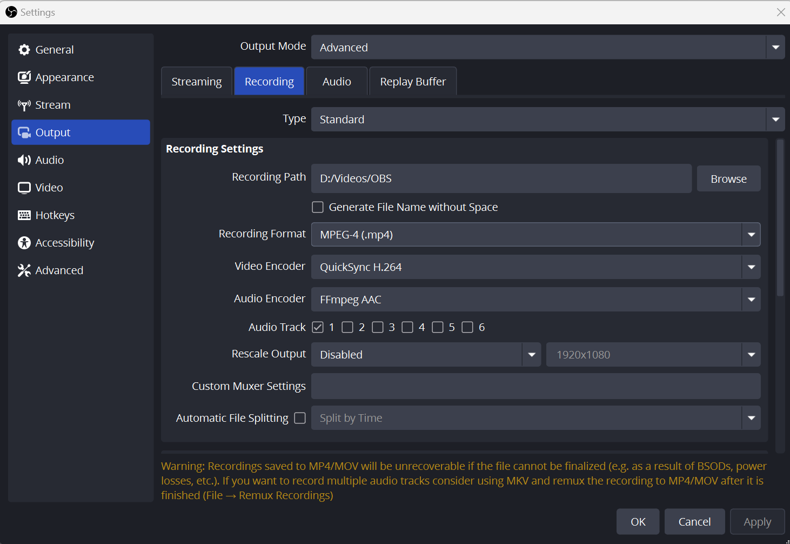
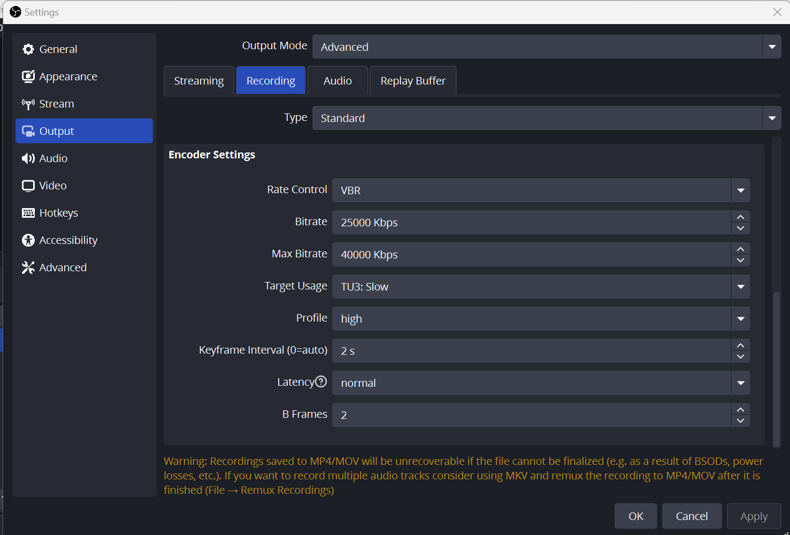

# Video Editing Settings

## OBS Studio

### Recommended QuickSync HEVC Settings in OBS Studio (1080p 60FPS)

1. **Output Settings**
    * **Output Mode**: Advanced
    * **Encoder**: QuickSync `HEVC`
    * **Rate Control**: `CQP` (Best for quality)
        * **CQ Level**: 17-20 (Lower = better quality, but larger file size)
        
        * **Alternative (if you prefer VBR)**: `I am using VBR`
            * **Target Bitrate**: 25,000 Kbps
            * **Max Bitrate**: 40,000 Kbps
    * **Keyframe Interval**: 2 seconds
    * **Profile**: Main 10 (for 10-bit color, better gradients) or Main (for standard 8-bit), I am using **Main** My laptop not support **Main10**
    * **Latency**: Normal
    * **B-Frames**: 2 (Recommended for better compression)

2. **Video Settings**

    * **Base (Canvas) Resolution**: 1920x1080
    * **Output (Scaled) Resolution**: 1920x1080 (No downscaling for max clarity)
    Downscale Filter: Lanczos (36 samples) (Best sharpness)
    * **FPS**: 60 FPS (or 30 FPS if needed for performance)

    *In Advance Setting*
    * **Color Format**: NV12
    * **Color Space**: 709
    * **Color Range**: Full (for better contrast in dark/light areas)

3. **Encoder: H.264** for Youtube Video
    I am keeoing bit rate 25000 and max Bitrate 40000kbps

    

4. Screen Shots if Settings

    **Video**
    * QuickSync HEVC(H.265)

        *Video Formate*

        
        *Encoder Property*
        

    * QuickSync H.264(H.265)
        
        
        
    *Video Colour*
    

    **Audio**
    *Audio Setting*
    
    
    
    *Audio Filter*
    > You need to add all these filters initially these filters will not be there.
    * Noise Suppresser
        
    * Compresser
        
    * Limiter
        
    * Noise Gate
        